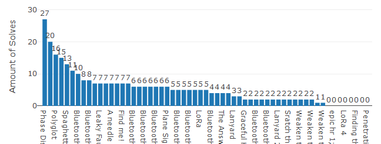
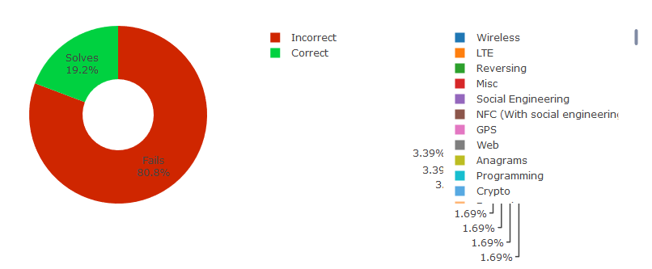
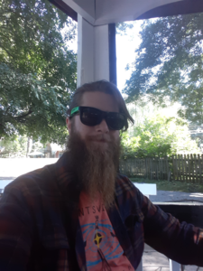
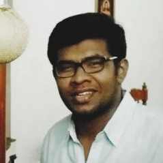

# GNU Radio Conference 2019 CTF

The 19th GNU Radio Conference capture the flag competition was a smashing success! With a wopping **47** teams participating, **59** out of the **61** challenges were solved. The challenges were primarily focused on wireless categories (it is a *radio* conference after all), with additional challenges focusing on forensics, cryptograpy and even anagrams. The participation and comradery of the teams was absolutely wonderful, with some of the teams even adding new challenges on-site for the other teams to complete.

Out of all of the CTF challenges, two stood out the most. The **BLE** challenge, created by *Hackgnar*, was a standard bluetooth challenge involving an **esp32** microcontroller. The teams had to use *gatttool* and *hcitool* to solve this 20-part challenge. The other notable challenge was **Graceful Hopper**. The teams had to use *Boost* and *UHD* to discover the flag being released from the frequency hops and the first team to solve the challenge recieved the device that was emitting the frequencies as a prize!

This ctf was able to come together thanks to our generous sponsors [SkySafe](https://www.skysafe.io/), [Cyburity](https://cyburity.com/) and [GAN, *Geeks and Nerds*](https://www.geeksandnerds.com/).
The server was created using [CTFd](https://github.com/CTFd/CTFd) and hosted on a [Linode](https://www.linode.com/) cloud server. The server was created, setup and managed by myself and my colleague, Vishal.

**Jonah Beasley**

* Head System Administrator for the CTF
* System Administrator for the University of Alabama in Huntsville

**Vishal Perekadan**

* System Administrator for the CTF
* Graduate Research Assistant and System Administrator for the University of Alabama in Huntsville
