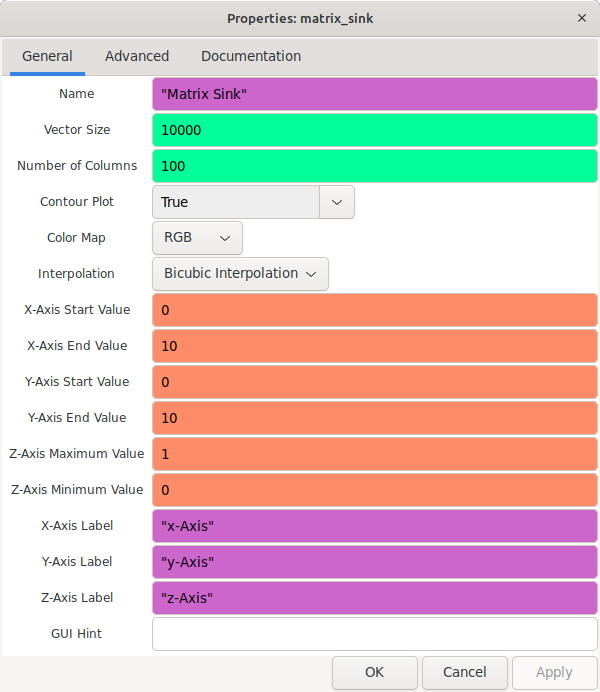
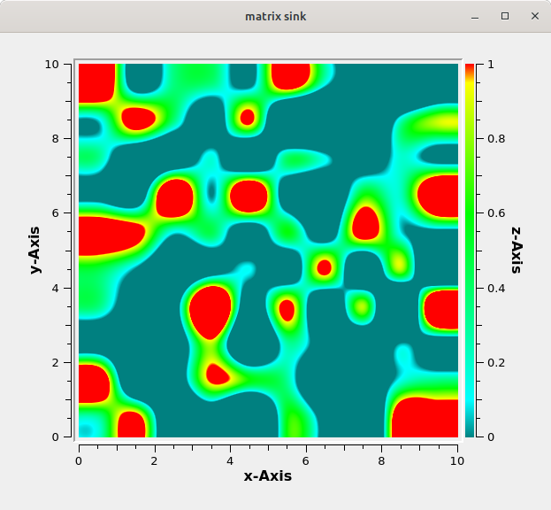

In this blog post, I will walk you through the journey of creating this block and share the valuable insights I gained from discussions with my mentor.

To kick off the project, I had a productive discussion with my mentor about the implementation and visualization aspects of the Matrix Sink block. We brainstormed ideas on how to best represent and display matrix data in a GUI, considering factors such as vector size, number of columns, color mapping, and interpolation. This initial conversation provided a solid foundation for the development process.

## Implementing the GUI Block

With the insights gained from the discussion, I began implementing the GUI block for the Matrix Sink. I started by creating the necessary classes and structures to handle the parameters and settings of the block. One of the essential tasks was defining the parameters and their functionalities, which included the name, vector size, number of columns, contour plot option, color map, interpolation method, and axis ranges.

After defining the parameters for the Matrix Sink block, the next step was to implement the matrix sink display itself. To accomplish this, I utilized the Qwt Spectrogram library, which provides powerful tools for visualizing matrix data.

Using the Qwt Spectrogram, I was able to create a visually appealing representation of the matrix data. The matrix was displayed as a color map, where each element in the matrix was associated with a specific color based on its value. This allowed for easy identification and interpretation of the data.

Additionally, I worked on adjusting the overall appearance of the Matrix Sink block. This involved fine-tuning the color map, axis labels, and various other visual elements to ensure a user-friendly and intuitive interface. The goal was to create a visually pleasing and informative display that would facilitate better understanding and analysis of the matrix data.

To demonstrate the functionality of the Matrix Sink block, I created a simple flowgraph that simulated a stream of vector data and visualized it using the Matrix Sink block. Here is an example picture of the flowgraph:

In this flowgraph, I utilized the Noise Source block from GNU Radio as the source of the stream data. The Noise Source generates random values that simulate real-time data.

The data stream is then converted into vector with the help of stream to vector block and passed through a Throttle block, which controls the rate at which the data is processed. This ensures that the visualization in the Matrix Sink block is updated at a manageable rate.

Next, the throttled vector stream is connected to the input of the Matrix Sink block. The Matrix Sink block is configured with the parameters set earlier, such as a vector size of 100 and a matrix size of 10x10. These parameters determine how the vector data is mapped and displayed on the spectrogram.

As the flowgraph runs, the vector data is continuously updated and displayed in real-time on the Matrix Sink spectrogram. The color map, axis labels, and other visual elements of the Matrix Sink block can be customized based on the parameters chosen.

## Week 2 [preview] :

In the second week of my GSoC project, I have planned to focus on three main tasks: 

1. Thoroughly document the Matrix Sink block, explaining each parameter and providing examples.

2. Design and implement comprehensive test cases to validate the functionality and reliability of the Matrix Sink block.

3. Integrate the Matrix Sink block into the GNU Radio QtGUI source tree for easy accessibility and usage in flowgraphs.

