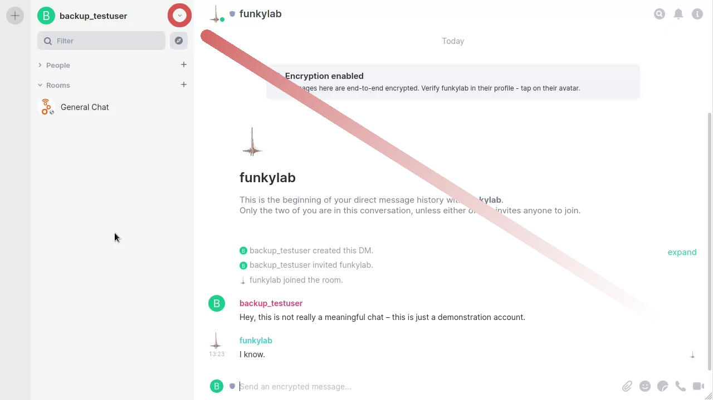
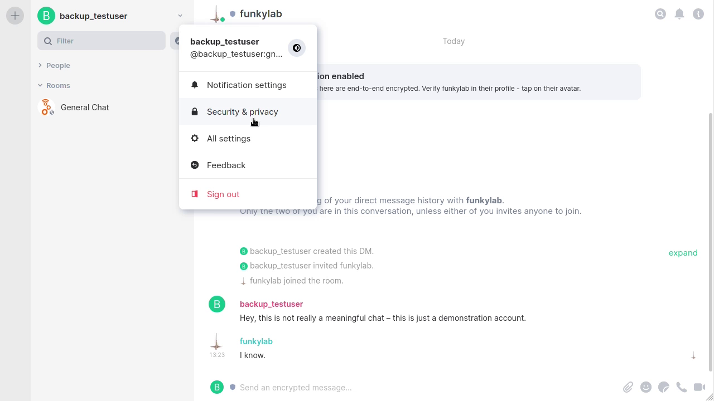
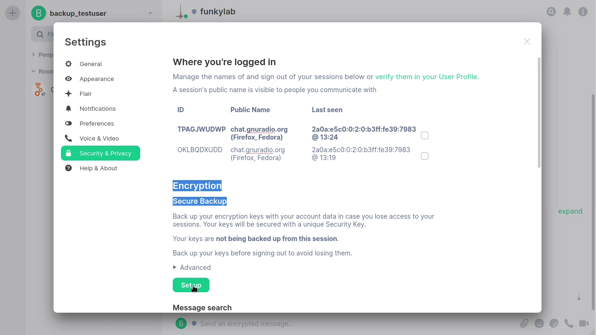
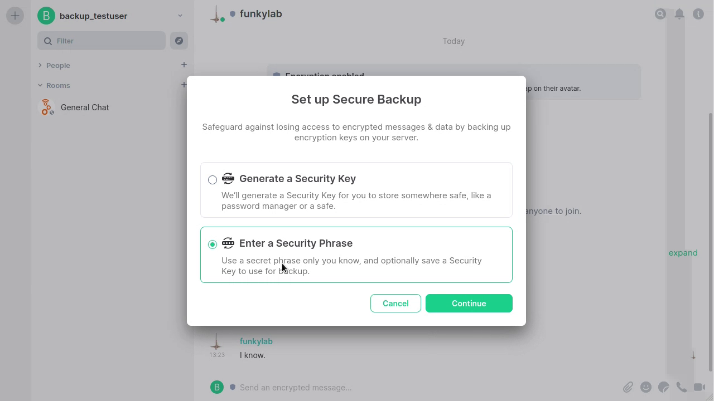
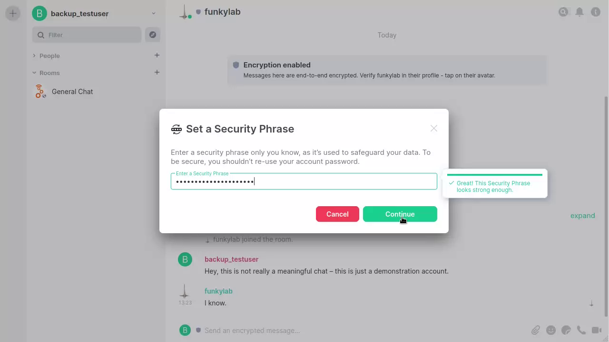
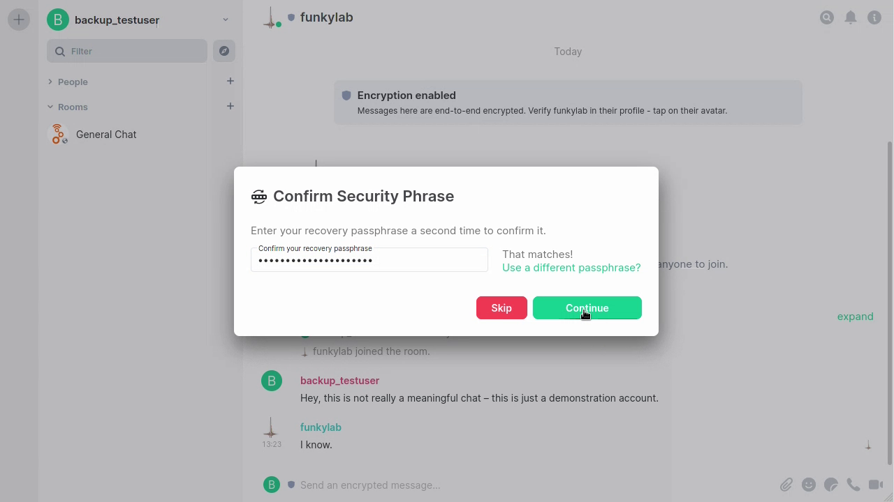
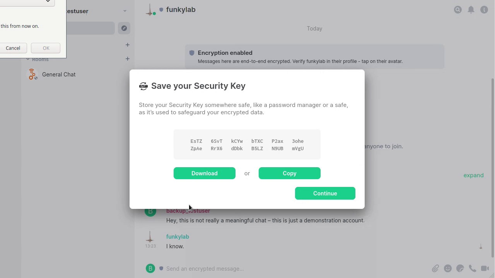
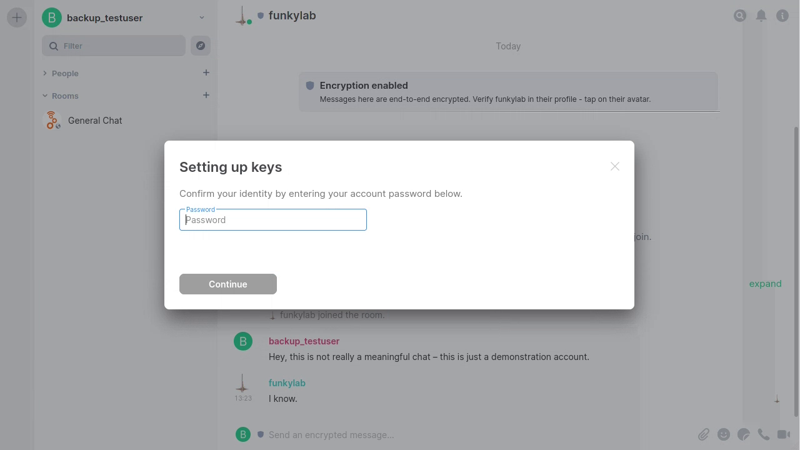

TL; DR: Go to Settings -> Security & privacy -> Secure Backup and click on the large "Set up" button, as shown in the video below.

Hey everyone!

The GNU Radio Matrix community has grown to be a staple of the SDR community - and that's a really great!

However, with this greatness comes some server load, so we're looking into making our Matrix infrastructure more robust, especially for GRCon reasons. To do that, we might need to migrate server data.

To you, as a user, this shouldn't mean a thing. Sadly, things aren't 100% as easy if you want to be able to access your old private chats after a migration: As Matrix enables end-to-end encryption for these by default, you need your secret keys. Your Matrix client (for most of you, that's the client on https://chat.gnuradio.org) takes care of en- and decrypting.

But, these keys are lost when you get logged out of all your sessions. A simple solution is to encrypt the keys, and put them on a server. That's what the "Secure Backup" in the Element chat client is. We've found out that not many have it enabled, so you'll have to do that, please:

Settings -> Security & privacy -> Secure Backup and click on the large "Set up" button, and follow the instructions:

## Open the Context Menu

Find the small downwards angle next to your user name in the top left of the screen

## Go to "Security & Privacy"

Click on the "Security & Privacy" menu item

## Click the "Secure Backup" button to "Set up"

## Select to enter a Security Phrase

## Enter a Security Phrase

This is what your Key gets encrypted with. This should not be your log in password.

## Repeat the Security Phrase

## Export your Security Key

Download your Security Key. This can alternatively to your Security Phrase be used to get your keys.

Click on the "Download" button.

## Enter your Account Passwort

Because we *really* need to be sure it's you, please enter your Matrix login password - *not* the security phrase set above.

That's it. You're done.

# Tutorial video

The above steps as video:


