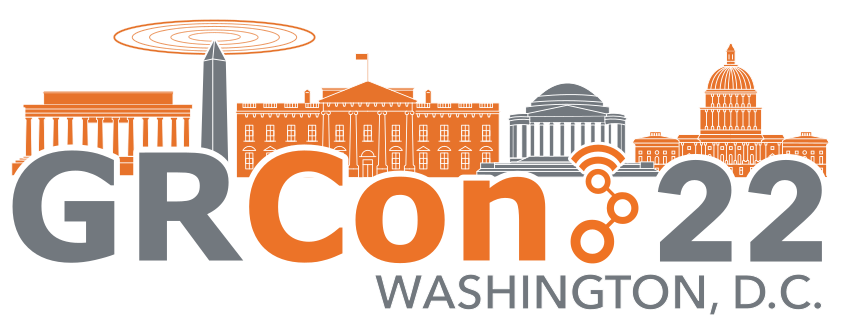

Dear GNU Radio community,

the GRCon'22 organizing committee has been able to set up all the financial mechanics behind the scenes, and so:

<h3>Conference Registration for the twelfth annual GNU Radio Conference is open!</h3>

<a href="https://tickets.gnuradio.org/grcon22/" class="btn btn-primary">
Ticket Shop
</a>

GRCon'22 takes place September 26 – 30, 2022 in Washington, DC.
It is the central event for the GNU Radio community, with its scope including
applications of  GNU Radio, technological, commercial and regulatory develop-
ments involving it and the SDR ecosystem. It traditionally hosts a wide range
of  governmental,  industrial,  academic and non-profit presentations and has
established itself as a prime venue for users, vendors, developers and scien-
tists involved in the FOSS SDR ecosystem.

Ticket prices remain fixed until the conference. It significantly helps our
ability to make financial commitments if you do register early, though.

In-Person Attendance Tickets
===================================

As we'll be able to meet up in person again this year, you'll find a couple of
in-person attendance ticket tiers.

These all grant the same level of access,
but address different target audiences.

<dl class="row">
<dt class="col-sm-3">
Standard Registration
</dt>
<dd class="col-sm-9">
If your organization is paying for you to attend,  please select this option.
</dd>

<dt class="col-sm-3">
Discounted Registration
</dt>
<dd class="col-sm-9">
If you're an individual attending at your own cost,
feel free to consider this option. The conference would be less useful to the
community and less attractive to our sponsors if you weren't there! If you
experience any doubts, please do reach out to grcon@gnuradio.org.
</dd>
<dt class="col-sm-3">
Student Registration
</dt>
<dd class="col-sm-9">
Heavily subsidized. Applies to students currently en-
rolled in a university program. In exchange for subsidizing your ticket, your
CV will be shared with our student sponsor. If you are a student and present
something at the conference, you can even get a free voucher.
Please read <a href="https://events.gnuradio.org/event/18/page/58-student-registration">the Student Regsitration Guide</a>
before selecting Student Registration.
  </dd>
<dt class="col-sm-3">
✨Patron Supporter Registration✨
</dt>
<dd class="col-sm-9">
Interested in providing additional support
to the project? Looking for an uncomplicated way to get your company logo (or
your personal logo?) on the GRCon'22 website?
This is the "easiest" and lowest-cost of our sponsorship levels; you pay an
extra $250 atop of the Standard Registration. See <a href="https://events.gnuradio.org/event/18/page/49-sponsorship-opportunities">Sponsorship Opportunities</a>!
</dd>
</dl>

Virtual Attendance Tickets
==========================

As has been for the last years, the GNU Radio conference will be <a href="https://grcon.stream">streamed</a>,
for free, and everyone participant, present or remote, is encouraged to partake in discussion using our online chat system.

You do not *have* to register to participate, but we would appreciate it.
It's a "pay what you want" system, and is designed to reduce the cost of the
streaming setup – after all, we're paying a professional crew full-time for the
main track to make sure our streams are good!

Even if you do not decide to pay anything, registration through the ticketing
interface gives us *statistics*, something we can use to dimension chat infrastructure, talk to future sponsors, and address the needs of our online audience better.

Call for Participation
======================

We still have open slots for

- Talks,
- Papers to be published in the proceedings,
- Workshops, where you can be passionate about something technical,
  regulatory or scientific with and towards a group of people in a
  breakout room,
- Posters, which typically are technical – but don't have to be!
- Friday Dev-Day Breakout Sessions and
- Lightning Talks

See <a href="https://events.gnuradio.org/event/18/abstracts/">the Call for Participation</a> on how to be a source of information at GRCon, and increase our
entropy!

