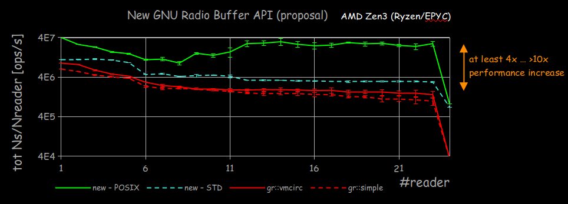
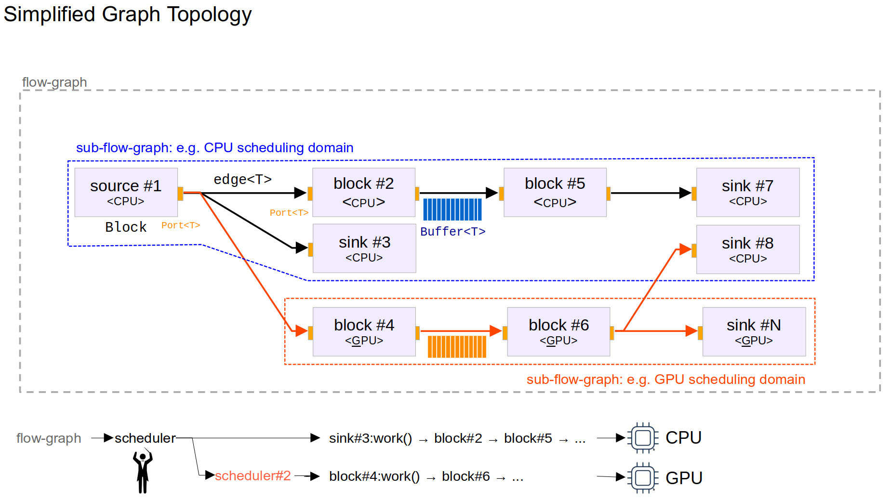

tl;dr - There is a [proposal](20221122_GNU_Radio_low_level_API_refactoring-2.pdf) on the table to further modernize the 4.0 codebase which can potentially bring some big performance benefits but may also carry some significant changes to the underlying implementation

***

With new constructs, abstractions, and a streamlined workflow, GNU Radio 4.0 as it currently stands has made significant progress toward it original stated goal: 
```
Straightforward implementation of (distributed) SDR systems 
that make efficient use of the platform and its accelerators
```
However the current implementation has relied heavily on traditional object oriented programming principles, following closely to the design methodologies of GR3.  Recent (and not-so-recent) versions of C++ have also evolved and provide powerful capabilities through modern programming techniques of which we have not fully taken advantage.  Of course there is a tradeoff between flexibility/modularity and performance and GNU Radio has traditionally focused on the modularity aspect. 


We have been very fortunate to have Dr. Ralph Steinhagen, who leads the accelerator-related signal-processing, diagnostics, and feedback system development activities at the Facility for Anti-Proton and Ion Research (FAIR), become a vital member of the GNU Radio community.  His OpenDigitizer project uses GNU Radio as a component in a much larger system for capturing particle accelerator beam measurements and providing users with a convenient processing framework for vast amounts of digitized samples. Ralph began engaging with the Architecture Working Group several months back, proposing some new core features that would allow GR to natively perform some of the functionalities that were being wrapped into out of tree modules, such as such as runtime reflection, asynchronous processing user-typed data, and grouping of ports.  Beyond these, he identified an opportunity to restructure some of the main constructs for the purpose of squeezing out more performance and introducing type safety, which should be of interest to any potential user of GR 4.0. (details can be seen [here](20221122_GNU_Radio_low_level_API_refactoring-2.pdf))

With GR 4.0 still in a development state, it is certainly not too late to revisit some of the key constructs to ensure that GR is set up well for the next decade or longer.  Thus Ralph has further proposed deeper API changes that will bring about some key enhancements in the codebase, namely:

- compile time type-safety
- less overhead through constexpr
- a more intuitive, leaner, and more extensible design

Let's take a look at each of these proposed enhancements to see what this would mean for a GNU Radio developer or user

### Type Safety

GNU Radio currently enforces type safety only in GRC by restricting the types of ports that can be connected together.  In the runtime, however GR relies on block developers in the work method to cast a `void *` pointer to the type of pointer needed to access the incoming or outgoing data.  Under the hood a buffer in GR is just a pointer to an array of bytes, and it is up to the user to provide correct information so that the arithmetic does not overflow its bounds.  Modern C++ provides techniques for ensuring data is accessed safely, such as the `std::span` provided with C++20 which further helps to prevent data corruption, segmentation faults, and catch issues at compile-time rather than runtime. 

Also, improving type safety should help improve performance in that being explicit with types, allows the compiler to better understand relationships and produce more efficient output.

But in order to have type safe blocks, this requires type safe ports, which requires type safe buffers.  Building from the ground up with a type safe buffer construct which has been proposed here: https://github.com/gnuradio/gnuradio/pull/6348 will allow type safety all the way up to the block work function, so instead of gaining access to a void * pointer, the block developer will have a more convenient and typed object to iterate over

before (GR3): 
```
auto *in = static_cast<float *>(input_items[0]);
```

proposed (GR4+)
```
auto in = get_port("in").get_items();
// in is a std::span<float> 
```
Note: Matrix representations of signals should also be more representable using more modern c++ constructs via the proposed c++23 mdspan (which is available as a c++20 backport)


The initial benchmarking of this buffer structure can be seen here - note that the y axis is in *operations per second*, **not** *streaming throughput*:
<!--  -->


Getting to this point, though, requires much more information to be provided to the block at compile time through templating.  This may appear cumbersome at first, but much of this code could become part of the yml->c++ code generation step and get right to the work method as quickly as before


#### Work implementations on non-standard types

Another benefit of the underlying buffer structure being strongly typed and not just bytes is that it can be used to pass more complex data structures using the circular buffers into the work methods of blocks.  For example, backpressure based PDU flowgraphs could be implemented just by defining a port as type PDU for asynchronous signal processing, and not merely through using the asynchronous message queues.  This will allow a more intelligent and efficient scheduling of packet based flowgraphs.


### Less overhead

When passing large amounts of data into a block with a computationally complex work function, the scheduler and lower level computational overhead from things like virtual table lookups are overshadowed by the computation done in the block.  But making the low level API as efficient and close to zero overhead as possible opens the door to different scheduling policies and paradigms that are able to process smaller chunks of data and maintain higher throughput while introducing less latency through the flowgraph.

With modern programming techniques, many of the operations that are performed in calculating the necessary information to perform work(), for example, can be more greatly optimized at compile time through constexpr.  Additionally, removing virtual inheritance from the hot path - namely, access to the circular buffers - can further reduce overhead.

### More intuitive design

One of the concerns about current GNU Radio block design is the sheer number of considerations necessary to ensure the block interacts appropriately with the scheduler.  This can be addressed effectively by enforcing a stronger separation of concerns in the hierarchy of classes and interfaces.  For example, having well defined buffer object associated with the port keeps the management of data in one place and not detached from the block structure. 

Also proposed is a realignment of the entities in the API to be cleaner an more intuitive as seen below:

<!--  -->


Just to give a rough idea of some of the proposed mechanisms, below is a snapshot of what a type safe block and port construct could look like in practice:
```c++
template<typename T, typename U = T, … >
requires (gr::util::is_one_of<T, supported_type>::value)
class myCopyBlock : public gr::node<"copy", gr::IN<"IN", T>, gr::OUT<"OUT", T>, int32_t, float, std::complex<float>> {
    // custom data members
    public:
        myCopyBlock(std::map<std::string, int> args = {{"answer"s, 42}, {"catch"s, 22}}) { /* [..] */ }
        static auto make(std::map<std::string, int> args) { return std::make_shared<myCopyBlock>(args); }

        constexpr bool work() { // generic -- called by scheduler
            constexpr gr::Port auto in = this->template inputPort<"IN">();
            //gr::Port auto in_err = outputPort<"IN">(); // correctly fails to compile
            constexpr gr::Port auto out = this->template outputPort<"OUT">();
            static_assert(in.name() == "IN", "requested input port does not match name");
            static_assert(out.name() == "OUT", "requested output port does not match name");
        
            // assemble the wio .... here: simple mock-only
            // CALL user-level work(wio)...
            return work(in.getReader(), out.getWriter());
        }

        constexpr bool work(/*BufferReader*/ auto input, /*BufferWriter*/ auto output) { // top-level user-specific code
            // ...
            return true; // return status
        }
        // [..]
};

```

## Moving forward

We want to make sure that the proposed changes still push closer to the goal of a streamlined development methodology, even if under the hood involves more modern C++ and advanced programming techniques. The next step is to produce a minimum viable product to generate some benchmarks and prove some of the use cases that can’t be accomplished in the current form of GNU Radio 4.0

## Feedback Requested
Please reach out to us with any feedback positive or negative.  There are several ways to stay engaged

1. `#architecture` on chat.gnuradio.org
2. architecture@gnuradio.org to reach the architecture leads directly
3. gnuradio-scheduler@groups.io to reach a broader group of interested people

[This document](https://gist.github.com/mormj/9d0b14d6db59ee7f313755c76498cc91) might also be helpful to comment on to drive what our high level requirements are to decide how flexible the implementation can become.

Please review the [slides](20221122_GNU_Radio_low_level_API_refactoring-2.pdf) if you are interested in digging further here

The Buffer API was merged into the `dev-4.0` branch as a standalone header only capability [here](https://github.com/gnuradio/gnuradio/pull/6348)

Also, be sure to check out the [`dev-4.0`](https://github.com/gnuradio/gnuradio/tree/dev-4.0) branch generally and the associated [issues](https://github.com/gnuradio/gnuradio/issues?q=is%3Aissue+is%3Aopen+label%3A%22GR+4.0%22) and get involved in the effort!