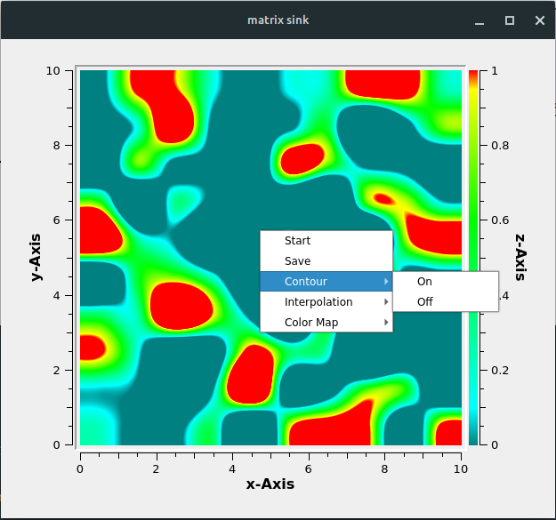

In this blog post, I am excited to share the progress made during Week 2 of the GSoC 2023 Qt Widgets Improvement project. In Week 1, I introduced the Matrix Sink block and its GUI representation. Now, I will walk you through the journey of adding mouse control events, fixing bugs, integrating with the GNU Radio Qt GUI Tree, and starting the development of the Video Display Widget.

## Adding Mouse Control Events to Matrix Sink Widget
To enhance user interaction, I implemented mouse control events for the Matrix Sink Widget. This new feature allows users to manipulate and explore the displayed matrix data using mouse actions such as click. It provides users with the ability to  stop the matrix sink display at any instance, save the current display as an image, toggle the contour plot option on or off, and change the interpolation method. 

## Bug Fixes and Error Corrections
Throughout the development process, I encountered various bugs and errors. I dedicated time to fixing these issues to ensure a smoother and more reliable user experience. By addressing these concerns, we are making the Matrix Sink Widget more robust and user-friendly.

## Integration with GNU Radio Qt GUI Tree
To make the Matrix Sink Widget easily accessible to users, I successfully integrated it with the GNU Radio Qt GUI Tree. This integration allows seamless incorporation of the Matrix Sink Widget into existing flowgraphs, enhancing the visual capabilities of GNU Radio.

## Week 3 [preview] :
In the second week of my GSoC project, I have planned to focus on two main tasks:

1. Start implementing the Video Display widget to enable playback of video streams, ensuring smooth and high-quality video rendering within GNU Radio.

2. Write comprehensive test cases to validate the functionality, compatibility, and performance of the Video Display widget, ensuring a robust and reliable feature for the GNU Radio community.

I am excited about the progress made so far and look forward to diving into these new tasks. Stay tuned for more updates in the upcoming blog post!
