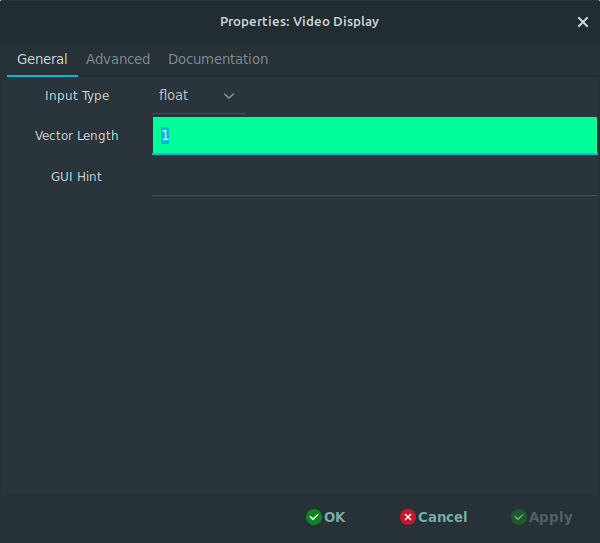
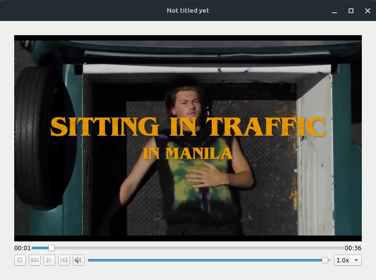
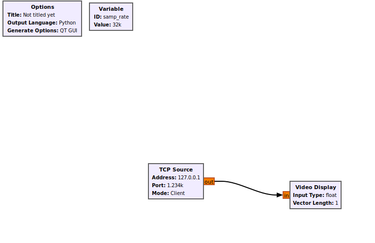
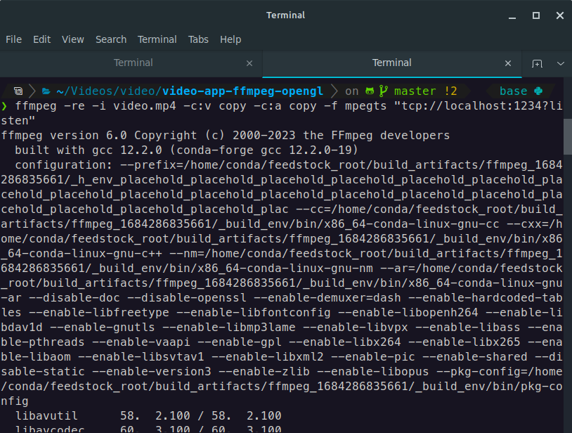

In this blog post, I will share the progress made during Week 3 of the GSoC 2023 Qt Widgets Improvement project. The focus of this week was on creating the Video Display block, which is an essential component for visualizing video data in GNU Radio.With this block, users can explore video data and perform various operations to enhance their understanding and analysis.

## Implementing the Video Display Block

To begin the implementation process, I first created the necessary classes and structures to handle the parameters and settings of the block. This included defining the parameters and their functionalities, such as the name and data type. I also worked on designing the overall appearance of the Video Display block, including play, skip forward and backwards 5 seconds and pause buttons, a slider for seeking through the video, and adjusting volume levels for audio playback.

After defining the parameters for the Video Display block, the next step was to implement the video display itself. To accomplish this, I utilized the Qt Multimedia library, which provides powerful tools for visualizing video data. Using the Qt Multimedia library, I was able to create a visually appealing representation of the video data in real-time along with audio playback.

Additionally, I worked on adjusting the overall appearance of the Video Display block. This involved adding various visual elements to the block, such as a slider for seeking through the video, adjusting volume levels for audio playback, and play, skip forward and backwards 5 seconds and pause buttons. The goal was to create a visually pleasing and informative display that would facilitate better understanding and analysis of the video data.

To demonstrate the functionality of the Video Display block, I created a simple flowgraph that simulated a stream of video data and visualized it using the Video Display block. Here is an example picture of the flowgraph:

In this flowgraph, I utilized the TCP Source block from GNU Radio as the source of the stream data. The TCP Source block is a simple block that allows users to send and recieve data over a TCP connection. The TCP source block gets stream of data from ffmpeg and sends it to the Video Display block. The Video Display block then visualizes the video data in real-time.

Here is the ffmpeg command that I used to generate the stream of video data:

## Week 4 [preview] :

In the fourth week of my GSoC project, I have planned to focus on three main tasks: 

1. Integrate the Video Display block with the GNU Radio Companion (GRC) GUI. 

2. Writing the documentation for the Video Display block.

3. Writing the tests for the Video Display block.