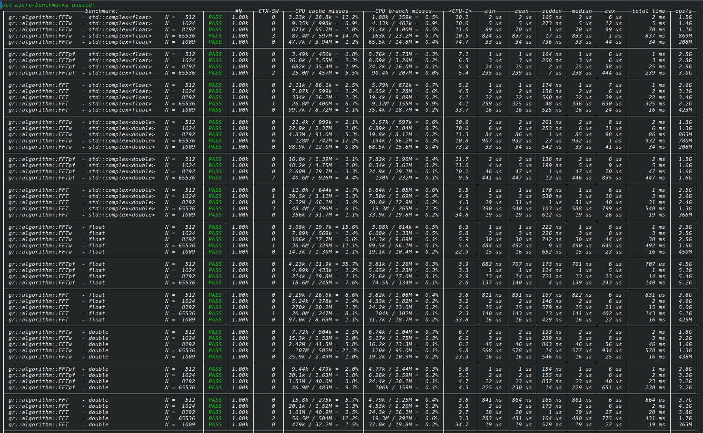
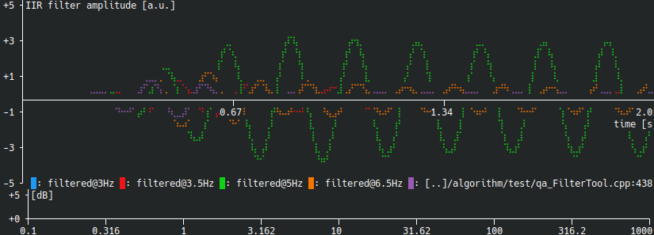

**GNU Radio 4.0 RC1: A New Foundation for High-Performance Signal Processing**

GNU Radio 4.0 has reached its first release candidate (RC1)—a major milestone that signals the transition from active development to **near-production readiness**.  See the [tag](https://github.com/fair-acc/gnuradio4/releases/tag/4.0.0-RC1) for all the details.

At this stage, the core architecture is stable, the execution model is well-defined, and the API is no longer expected to undergo major breaking changes. Developers can begin building against GR4 today with confidence that their work will carry forward into the final release.

GNU Radio 4 is a **fundamental re-architecture** of the system—designed for modern C++, deterministic execution, and high-performance pipelines that scale from embedded systems to large, complex DSP applications, while remaining accessible for research and hobbyist use.

This is not an incremental update. It is a new foundation for building signal processing systems.

---

## What’s New and Exciting in GNU Radio 4

### Modular execution and scheduler flexibility

GR4 introduces a fundamentally new execution model built around **modular schedulers and explicit control over data movement and execution**.

Rather than relying on a single, fixed scheduler, GR4 allows developers to **select or implement schedulers** that match their specific workload and deployment environment. This makes execution a configurable part of the system, not a hidden implementation detail.

This model is designed to support a wide range of use cases:

- Low-latency streaming pipelines  
- High-throughput batch processing  
- Execution across heterogeneous compute environments (CPU, GPU, accelerators)  

By separating the *what* (the signal processing graph) from the *how* (the execution strategy), GR4 enables systems to evolve naturally from research prototypes to production deployments. Execution becomes a configurable aspect of the system, not a fixed runtime constraint.

---

### Compile-time composition for zero-overhead pipelines

Signal chains in GR4 can be composed at compile time, enabling:

- Elimination of intermediate buffers  
- Full compiler optimization across block boundaries  
- Highly efficient, fused execution paths  

GR4 provides a formal API for compile-time composition via `BlockMerging.hpp`, enabling developers to construct reusable, type-safe compositions of blocks (linear, feedback, and parallel forms) that the compiler can fully optimize. These constructs can be used directly to build high-performance pipelines with zero runtime overhead between blocks.  This shifts performance optimization from runtime tuning to compile-time structure—allowing the compiler to generate globally optimized signal paths.

This capability is central to GR4’s performance gains.  As an example take a look at the representative results for 1M float samples, 10 iterations, single-threaded, on a modern x86-64 CPU.:

```
┌──────────────────────────────────────────────────────────────────┬──mean──┬─median─┬───ops/s──┐
│ runtime   src->copy->sink                                        │   6 ms │   6 ms │    162M  │
│ runtime   src->mult->div->add->sink                              │  12 ms │  12 ms │   87.0M  │
│ runtime   src->(mult->div->add)^10->sink                         │  96 ms │  91 ms │   10.4M  │
│ runtime   IIR low-pass (feedback)                                │ 101 ms │        │    994k  │
├──────────────────────────────────────────────────────────────────┼────────┼────────┼──────────┤
│ merged    src->sink                                              │   3 ms │   2 ms │    381M  │
│ merged    src->mult->div->add->sink                              │   5 ms │   5 ms │    187M  │
│ merged    src->(mult->div->add)^10->sink                         │   8 ms │   7 ms │    133M  │
│ merged    IIR low-pass (FeedbackMerge)                           │   9 ms │   9 ms │    113M  │
├──────────────────────────────────────────────────────────────────┼────────┼────────┼──────────┤
│ constexpr src->sink                                              │  39 µs │  39 µs │   25.4G  │
│ constexpr src->mult->div->add->sink                              │  39 µs │  39 µs │   25.4G  │
│ constexpr src->(mult->div->add)^10->sink                         │ 351 µs │ 349 µs │    2.9G  │
│ constexpr IIR low-pass (FeedbackMerge)                           │ 153 µs │ 152 µs │    656M  │
└──────────────────────────────────────────────────────────────────┴────────┴────────┴──────────┘
```

---

### Modern C++ with type-safe design

GR4 is built on modern C++ principles with a strong emphasis on **type safety, clarity, and developer productivity**.

- Strongly typed interfaces  
- Compile-time validation of connections and configurations  
- Explicit error handling via `std::expected`  

At the same time, the developer workflow is intentionally simple. A block can often be implemented with minimal boilerplate using a `processOne` method, letting the framework handle scheduling, buffering, and vectorization.

For example, a simple gain block:

```cpp
template <typename T>
struct Multiply {
    T k;
    auto processOne(T in) {
        return in * k;
    }
};
```

That’s it—no manual buffer management, no scheduler interaction, and no complex inheritance hierarchy. 

GR4 handles:
- Invoking `processOne` with the appropriate SIMD width  
- Managing input/output flow  
- Integrating the block into larger pipelines  

This model makes it easy to write clean, testable DSP components while still achieving the full performance of the GR4 runtime.

Error handling is standardized across the API using `std::expected`, ensuring that graph construction, connection, and execution failures are explicit and composable. This eliminates hidden failure modes and aligns GNU Radio with modern C++ best practices for building robust systems.

---


### Plugin system with built-in reflection

GR4 introduces a plugin architecture with **built-in reflection**, providing a single source of truth for block definitions and a reliable interface for external tooling.  The reflection system provides a reliable interface for external tooling. Block metadata—including parameters, ports, and constraints—can be programmatically extracted and used to drive validation, UI generation, and automated system construction. This enables higher-level systems to interact with GNU Radio in a structured and extensible way.

This enables:

- Automatic discovery of blocks and capabilities  
- Simplified tooling and UI generation  
- Dynamic validation and configuration  
- Integration with higher-level systems, including AI-driven workflows  

This is a foundational capability that unlocks an entire class of tooling beyond traditional DSP pipelines.  This effectively turns GNU Radio into a self-describing system, where graphs and blocks can be reasoned about programmatically rather than just executed.


---


### SIMD-first architecture and SimdFFT

GR4 is designed from the ground up for SIMD efficiency.

The introduction of **SimdFFT** (PR #671) extends this philosophy to FFT operations:

- SIMD-aware FFT implementation aligned with GR4 pipelines  
- Reduced overhead compared to traditional FFT integration approaches  
- Seamless integration with compile-time composition and fused pipelines  

This makes SIMD a **first-class concern across the entire signal chain**, not just isolated kernels.



Try out the new FFT blocks on your machine and see how your benchmarks compare.

Reference: https://github.com/fair-acc/gnuradio4/pull/671

---

### Explicit graph lifecycle and runtime control

GR4 introduces a clear and explicit lifecycle for graphs and execution:

- Graph construction and validation are separate from execution  
- Runtime instantiation is an explicit step  
- Start/stop behavior is deterministic and externally controllable  

This separation enables integration with external orchestration systems, services, and control planes. This makes it possible to treat signal processing graphs as managed runtime resources—enabling service-based architectures, remote execution, and automated system workflows.

---

### Performance that redefines the baseline

These architectural changes translate directly into substantial performance gains:

- 2–10× gains from eliminating inter-block buffers  
- Orders-of-magnitude improvements in feedback-heavy systems (e.g., IIR, PLL)  
- Fully compile-time execution reaching **tens of GS/s**  

These improvements fundamentally expand what is feasible in GNU Radio.  These gains are not isolated optimizations—they are a direct result of the architectural changes in GR4.

---

### WebAssembly (WASM) support

GR4 includes improved **WebAssembly support**, enabling DSP pipelines to run directly in browser and sandboxed environments.

This unlocks entirely new classes of applications:

- Interactive, browser-based DSP tools  
- Portable demos and training environments  
- Secure, sandboxed execution of signal processing pipelines  

A great example of this model is **OpenDigitizer**, which demonstrates how GR4-based processing can be paired with a modern web frontend. By running DSP components in WASM and connecting them to browser-based visualization and control, applications can be delivered with zero local installation—just a URL.


This model enables:

- Rich, interactive SDR applications accessible from anywhere  
- Tight integration between DSP pipelines and modern web UIs  
- Rapid sharing of experiments, demos, and tools  

WASM support in GR4 is a key step toward making signal processing more accessible, portable, and integrated with modern application ecosystems.

---

### SoapySDR integration

Built-in **SoapySDR integration** simplifies access to a wide range of SDR hardware:

- Unified hardware abstraction layer  
- Easier portability across devices  
- Cleaner separation between DSP logic and hardware  

SoapySDR integration benefits from the improved runtime and scheduling model, allowing hardware interaction to be more cleanly decoupled from processing logic. This improves testability and makes it easier to substitute simulated or recorded data sources during development.

---

### Permissive core licensing

The GR4 core adopts a more **permissive licensing model**, lowering barriers for adoption:

- Easier integration into commercial systems  
- Greater flexibility for mixed-license environments  
- Broader ecosystem participation  

---

### Integrated filter design capabilities

GR4 continues to build on GNU Radio’s long-standing strength in **digital filter design**, while evolving toward tighter integration with the runtime and modern APIs.

With ongoing work (PR #218), filter design is becoming part of a more **unified, end-to-end system design workflow**:

- Filter design is no longer a disconnected preprocessing step  
- Designed filters integrate naturally into compile-time pipelines  
- Parameters can be tied into runtime configuration and reflection metadata  
- Enables future schema-driven and tool-generated filter design  

This aligns with GR4’s broader direction: a **cohesive signal processing environment** rather than a collection of loosely connected tools.

There are even console plotting tools included in the designer to keep dependencies minimal!




Reference: https://github.com/fair-acc/gnuradio4/pull/218

---

### macOS and Windows support (seeking contributors)

macOS ARM64 support has recently made strong progress, with builds now passing tests.  Windows has been supported for some time.

To reach full production readiness, each new build platform needs a dedicated maintainer to track issues, maintain CI stability, and drive platform polish.

Contributors interested in helping push macOS and Windows support forward are encouraged to get involved.

Reference: https://github.com/fair-acc/gnuradio4/pull/725

---

## Recent API Changes

As GR4 approaches production readiness, the API has been simplified and stabilized.  But take note of these things if you have already been working with applications in GR4.

### Connection API

The fluent `.connect().to()` chain has been removed in favor of explicit calls returning `std::expected`:

```cpp
// runtime (plugins, Python, GRC)
graph.connect(src, "out", sink, "in");

// compile-time (C++)
graph.connect<"out", "in">(source, sink);

// chaining
graph.connect<"out", "in">(src, filter)
    .and_then([&] {
        return graph.connect<"out", "in">(filter, sink);
    });
```

This approach removes implicit chaining semantics and replaces them with explicit, composable operations. It improves debuggability, makes error propagation visible, and aligns graph construction with modern functional-style C++ patterns. 

---

### Compile-Time Block Composition

`BlockMerging.hpp` introduces compile-time composition of block types.  These composition primitives form the foundation for building high-performance reusable DSP components.

#### Linear merge

```cpp
using Chain = gr::Merge<ScaleA<float>, "out", ScaleB<float>, "in">;
auto& merged = graph.emplaceBlock<Chain>();
```

#### Feedback merge

```cpp
using IIR = gr::FeedbackMerge<
    Adder<float>, "out",
    Scale<float, alpha>, "out", "in2"
>;
```

#### Parallel paths

```cpp
using Diff = gr::SplitMergeCombine<
    gr::OutputSigns<+1.0f, -1.0f>,
    ScaleA,
    ScaleB
>;
```

These constructs can be composed and nested to build highly optimized signal graphs.

---

### SIMD-Aware Sources

Source blocks can implement:

```cpp
processOne(constexpr_value auto N)
```

The runtime selects an optimal SIMD width automatically.

---

### Build and Platform Notes

- `find_package(gnuradio4)` provides a clean integration path for external projects  
- Optional libc++ support under Clang 
- Static vs shared linking behavior is well-defined across platforms  
- Toolchain consistency (e.g., libstdc++ vs libc++) is important for downstream consumers  
- WASM builds via Emscripten are a supported workflow  

---

## Getting Involved

We are actively looking to grow the ecosystem around GR4—applications, blocks, integrations, and tooling that build on the architecture.  Please give RC1 a try - Further changes beyond RC1 are expected to be additive.  The focus now is on expanding the ecosystem—applications, blocks, integrations, and tooling that build on the GR4 architecture.

Areas where contributions are especially impactful:

- Block development and migration from GNU Radio 3  
- Hardware integration (SoapySDR and beyond)  
- Tooling and ecosystem development  
- Platform support (including macOS)  
- Documentation and examples  

For more info:
* Repository: https://github.com/gnuradio/gnuradio4 (synced to tagged releases from https://github.com/fair-acc/gnuradio4)
* Join the conversation on https://chat.gnuradio.org
* Email us architecture@gnuradio.org with any questions or comments - tell us about your use case and results!!!

---

## Acknowledgements

GNU Radio 4 represents years of work across a dedicated and growing community.  GR4 has been co-developed by the team at FAIR (GSI), where it originated from the need for a modern, high-performance framework for real-time accelerator signal processing. That environment has strongly influenced its design goals around safety, latency, throughput, and determinism—benefiting users across industries and applications.  At the same time, development is happening in the open, with ongoing contributions and direction from the broader GNU Radio community, reflecting a mix of research, industry, and hobbyist use cases rather than a single institutional focus, but we are grateful for the incredible development effort and foundation from the researchers at FAIR.  

---

## Summary

GNU Radio 4 represents a turning point:

- A **modern, high-performance signal processing architecture**  
- A **flexible execution model that adapts to diverse deployment environments**  
- A **foundation for building programmable, composable DSP systems**  

GR4 is not just an evolution of GNU Radio—it is a rethinking of how signal processing systems are designed, optimized, and deployed.


